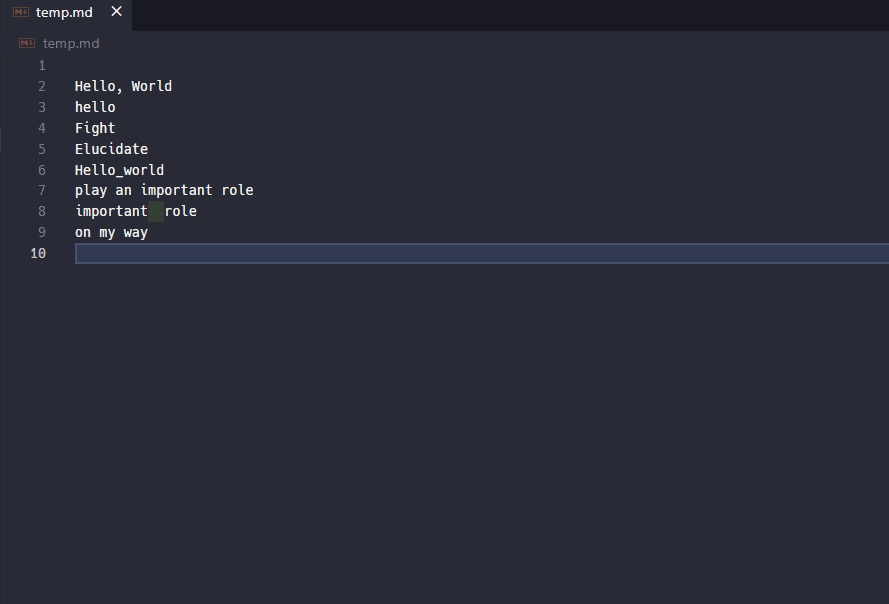

# VSCode-Hovering-Dictionary

Hovering-Dictionary is a VSCode extension for looking up words your mouse cursor is indicating.

This extension is inspired by [Mouse Dictionary](https://github.com/wtetsu/mouse-dictionary/) (MIT License, wtetsu, 2018).

## Features

**Fast looking up words with case sensitivity**


(Note that this demonstration was hold after importing 英辞郎(EIJIRO) dictionary data, see [#importing-dictionaries](#importing-dictionaries). Many expressions such as "on one's own" are NOT included in the default dictionary.)

[Mouse Dictionary](https://github.com/wtetsu/mouse-dictionary/) provides very fast and flexible way to refer to a dictionary.
By partially using the code in this chrome extension, I realize its similar function in VSCode!

### Importing dictionaries

This extension includes default dictionary provided in [ejdict-hand](https://github.com/kujirahand/EJDict) (Public Domain).
In addition, you can import any dictionary formats you could import in [Mouse Dictionary](https://github.com/wtetsu/mouse-dictionary/).

You can import the dictionaries via the command `hovering-dictionary.import-dictionary`.

plz refer to [Download dictionary data](https://github.com/wtetsu/mouse-dictionary/wiki/Download-dictionary-data) in [Mouse Dictionary](https://github.com/wtetsu/mouse-dictionary/).

## development

```shell
git clone https://github.com/Take-Me1010/vscode-hovering-dictionary.git
cd vscode-hovering-dictionary
yarn        # or npm i
code .
# debug this extension by F5 key.
```
